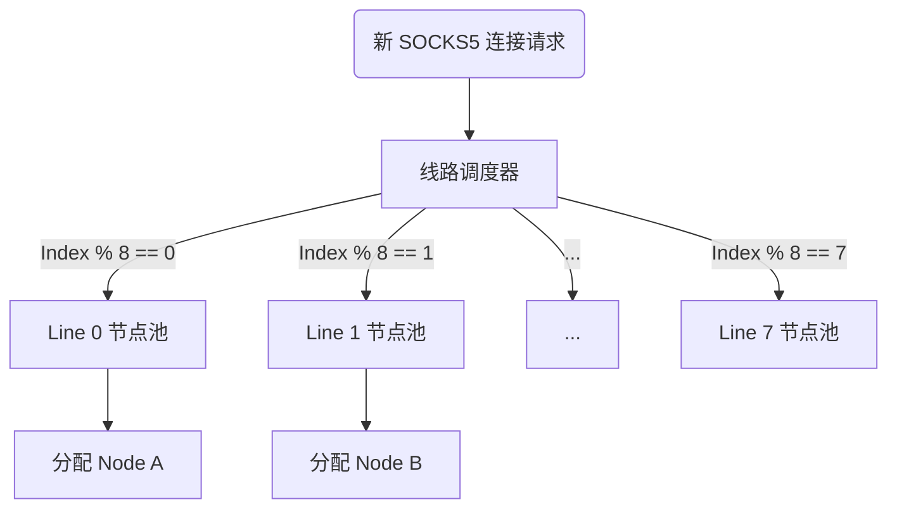

# 多网卡环境下 SOCKS5 单连接均衡设计方案 (简化版)

## 1. 业务逻辑变更
*   **前提条件：** 每个 SOCKS5 连接请求仅需分配 **一个** IoT 设备。
*   **核心目标：** 确保当用户建立大量连接时，这些物理连接能均匀地分布在所有 8 条 PPPoE 线路上，从而聚合利用总带宽。

## 2. 极简设计方案：全局线路轮询 (Global Line Round-Robin)

为了实现带宽最大化利用，`ippop` 不需要对单用户执行复杂的资源配额预计算，只需在节点选择阶段加入“线路轮次”意识。

### 2.1 核心算法描述
1.  **资源分组（内存标记）：** `ippop` 在内存中维护 8 个列表（List），每个列表对应一个物理线路（Line ID $0 \dots 7$）。
2.  **轮询计数器：** 系统维护一个原子递增的全局计数器 `AtomicNextLineIndex`。
3.  **节点分配流程：**
    *   当一个 SOCKS5 用户发起新连接请求时：
    *   计算目标线路索引：`targetIdx = AtomicIncrement() % 8`
    *   从 `List[targetIdx]` 中，根据负载均衡规则（如负载最低或随机）取出一个在线的 IoT 节点返回。
    *   *自愈策略：* 若 `targetIdx` 线路上当前没有可用节点，则顺延至 `(targetIdx + 1) % 8`。

### 2.2 逻辑示意图

## 3. 实现复杂度分析 (低耦合)
*   **数据模型：** 无特殊修改。只需在节点注册/心跳（Heartbeat）时，根据其所属的公网 IP 段段位，自动打上 `LineID` 标签入库。
*   **逻辑介入：** 该逻辑仅需在 `SelectNode` 函数入口处增加“按线路轮循”的分发规则，不会对用户的业务流程产生浸入式修改。

## 4. 预期效果
*   **高并发场景：** 当用户开启 100 个并发 SOCKS5 连接时，每个线路约分配 12~13 个连接，流量会被极其均匀地导向 8 条物理出口。
*   **带宽聚合：** 即使单个 SOCKS5 承载力有限，但整机流量将完美叠加到 8 条线的理论峰值。

## 5. 结论
这种基于“单连接一维轮询”的设计方案在实现上成本极低，且能够完美解决多网口环境下的流量倾斜问题，是当前场景下的最优工程实践。
