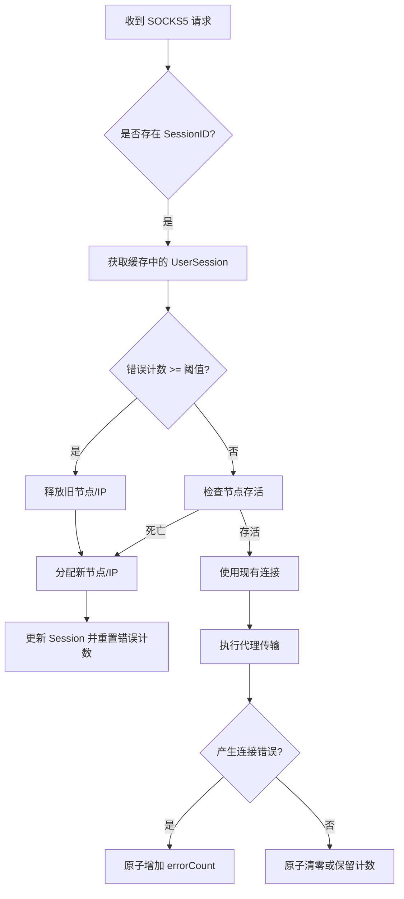

# 设计方案：基于错误计数的 Session 自动重分配机制

## 1. 背景与目标
在 `Custom` 路由模式下，用户通过 `sessionID` 绑定固定的出口 IP。但如果该 IP 出现故障、由于某种原因被目标网站拦截、或者节点不稳定，会导致该 Session 下的连接持续失败。

本设计的目标是：
- 记录每个 Session 的连接错误次数。
- 当错误次数超过预设阈值时，自动解除当前的 IP 绑定。
- 在下一次请求时，为该 Session 重新分配一个新的出口 IP，从而实现故障自动恢复。

## 2. 技术设计

### 2.1 数据结构变更 (`ippop/ws/allocator.go`)
在 `UserSession` 结构体中增加错误计数器：

```go
type UserSession struct {
    // ... 原有字段
    errorCount   int32         // 累计错误次数（原子操作）
    // ...
}
```

同时在 `SessionManager` 中定义默认的错误阈值（例如 5 次）。

### 2.2 错误上报机制 (`ippop/ws/tunmgr.go`)
在代理处理逻辑中，捕获连接握手和传输初期的错误：

- **HandleSocks5TCP**: 
    - 调用 `tun.acceptSocks5TCPConn` 后检查返回值。
    - 如果返回非空错误（且非客户端主动关闭等预期内错误），调用 `userSession.ReportError()`。

```go
err := tun.acceptSocks5TCPConn(tcpConn, targetInfo)
if err != nil && userSession != nil {
    // 逻辑：如果握手失败或连接建立失败，增加错误计数
    userSession.ReportError() 
}
```

### 2.3 自动切 IP 逻辑 (`ippop/ws/allocator_session.go`)
在 `SessionAllocator.Allocate` 方法中增加检测逻辑：

1. **获取 Session**：通过 `GetAndActivate` 获取现有 Session。
2. **检查阈值**：
   - 检查 `sess.errorCount` 是否大于等于 `MaxErrorThreshold`。
   - 如果超过阈值，主动释放该 Session 当前绑定的 `deviceID` 和 `exitIP`，并将其设置为空。
3. **触发分配**：
   - 逻辑流转至“分配新节点”的代码块。
   - 获取新节点后，通过 `UpdateAllocation` 更新 Session，并**重置** `errorCount` 为 0。

### 2.4 关键流程图



## 3. 细节考虑

- **错误计数权重**：并非所有错误都应导致切 IP。例如负载均衡正常关闭不计数。
- **并发冲突**：由于 `errorCount` 采用原子操作 (`atomic.AddInt32`)，可以保证在高并发下的准确性。
- **成功重置**：如果 Session 成功完成了一次高质量的传输（如连接建立成功并传输了首字节），可以考虑原子将其错误计数重置为 0，以避免长时间累计导致的误切。

## 4. 预期效果
该机制上线后，对于死掉的 IP 或被封禁的出口 IP，用户只需要重试几次，系统就会自动完成 IP 的更换，无需人工干预或等待 Session 过期。
