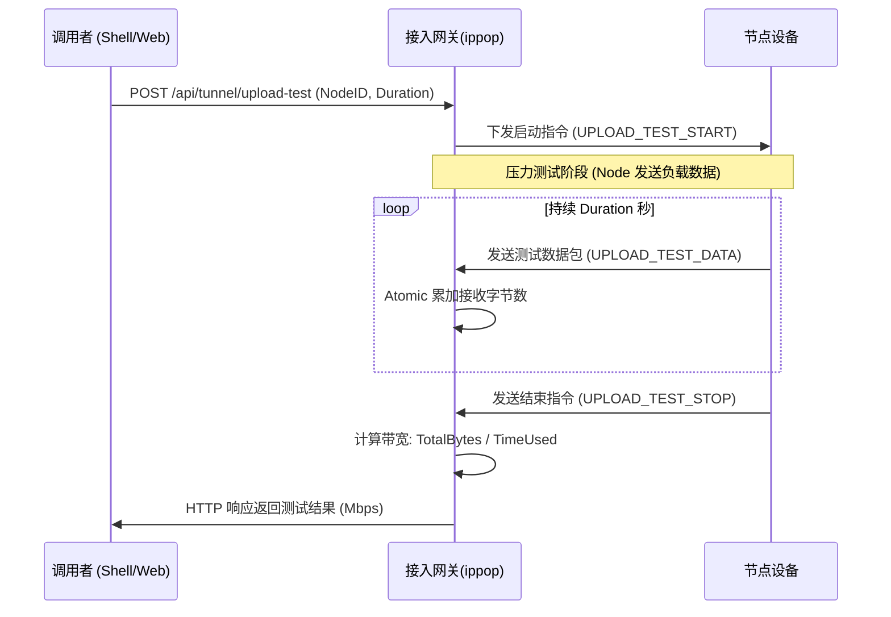

# Tunnel 节点上行带宽测试设计文档 (Upload Test)

## 1. 目标
衡量节点（Node）到服务器（ippop/Server）方向的上传能力。通过在现有 WebSocket 隧道上发送高速测试数据流，准确测量节点在真实网络环境下的物理上传带宽。

## 2. 交互模型
测试由外部调用者通过 `ippop/ws` 暴露的 HTTP API 直接发起。`ippop` 负责下发指令给 Node，并同步或异步返回结果。



## 3. 协议设计 (Protobuf)

在 `message.proto` 中增加专用枚举和结构：

```protobuf
enum MessageType {
    // ... 原有类型
    UPLOAD_TEST_REQ  = 10; // 控制指令 (START/STOP)
    UPLOAD_TEST_DATA = 11; // 纯负载数据包
}

message UploadTestRequest {
    enum Action {
        START = 0;
        STOP  = 1;
    }
    Action action = 1;
    int32 duration = 2;    // 预期测试时长（秒）
    string session_id = 3; // 会话唯一 ID
}

message UploadTestResult {
    string session_id = 1;
    string node_id = 2;
    uint64 total_bytes = 3;
    int32 duration_ms = 4;
    double bandwidth_mbps = 5;
    bool success = 6;
}
```

## 4. 核心实现逻辑

### 4.1 节点端 (Node - 发送方)
*   **并发打流**：收到 `START` 指令后，开启独立协程进入循环发送。
*   **内存优化**：预先分配一个 **32KB** 的静态 `[]byte` 缓冲区，填充随机数据或全零，循环通过 WebSocket 发送该缓冲区。
*   **结束触发**：
    *   **主动结束**：本地计时达到 `duration` 秒后，停止发送数据并发送一个 `STOP` 类型的 `UploadTestRequest`。
    *   **异常处理**：若 WebSocket 断开，自动终止发送。

### 4.2 服务器端 (ippop - 接收方)
*   **零拷贝识别**：修改 `Tunnel.onMessage` 的解包逻辑。当识别到 `MessageType_UPLOAD_TEST_DATA` 时：
    1.  直接累加 `t.uploadTestCounter`。
    2.  **立即返回 `nil`**。彻底跳过后续的解包、Session 查找、流量均衡等复杂业务逻辑。
*   **统计计算**：
    *   记录 `StartTime`。
    *   收到 `STOP` 指令或超时（`duration+2s`）后，计算：`(TotalBytes * 8) / (TimeUsed_ms / 1000) / 10^6`。

## 5. 性能优化与约束

1.  **限速器豁免**：在 `readMessageWithLimitRate` 中，识别到是测试包时，**不应调用 `LocalRateLimiter.Wait`**，否则测得的是配置上限而非物理上限。
2.  **包大小平衡**：设置单包 Payload 为 32KB。包太大容易引起网络抖动，太小则 CPU 开销过高。
3.  **状态互斥**：一个 Tunnel 在同一时刻只能参与一项测试。使用 `atomic.CompareAndSwap` 保护测试状态。
4.  **安全保护**：为防止恶意 Node 持续打流耗尽服务器资源，`ippop` 必须在达到 `duration` 后自动关闭计数器并拒绝后续的测试包。

## 6. ippop 接口设计 (WS API)

*   **发起单点测试**：`POST /api/tunnel/upload-test`
    *   **参数**：`{ "node_id": "...", "duration": 10 }`
    *   **响应**：`{ "mbps": 45.2, "total_bytes": 5651234, ... }`
*   **批量测试逻辑**：由于 ippop 主要是接入层，建议复杂的随机抽取逻辑仍保留在 Manager 或脚本中，通过循环调用此 API 实现。

---
*版本：v1.0 (Upload Only)*
*日期：2026-03-06*
